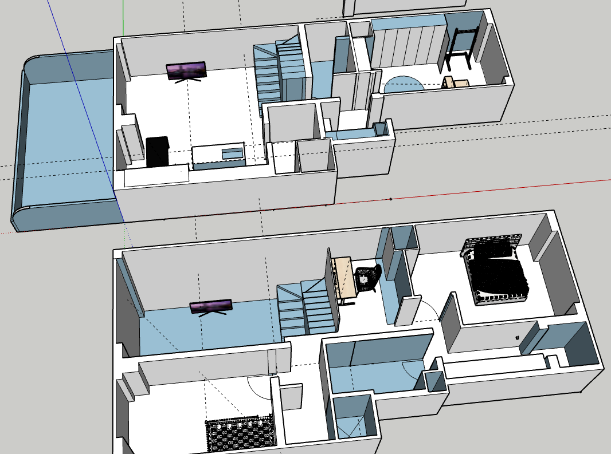
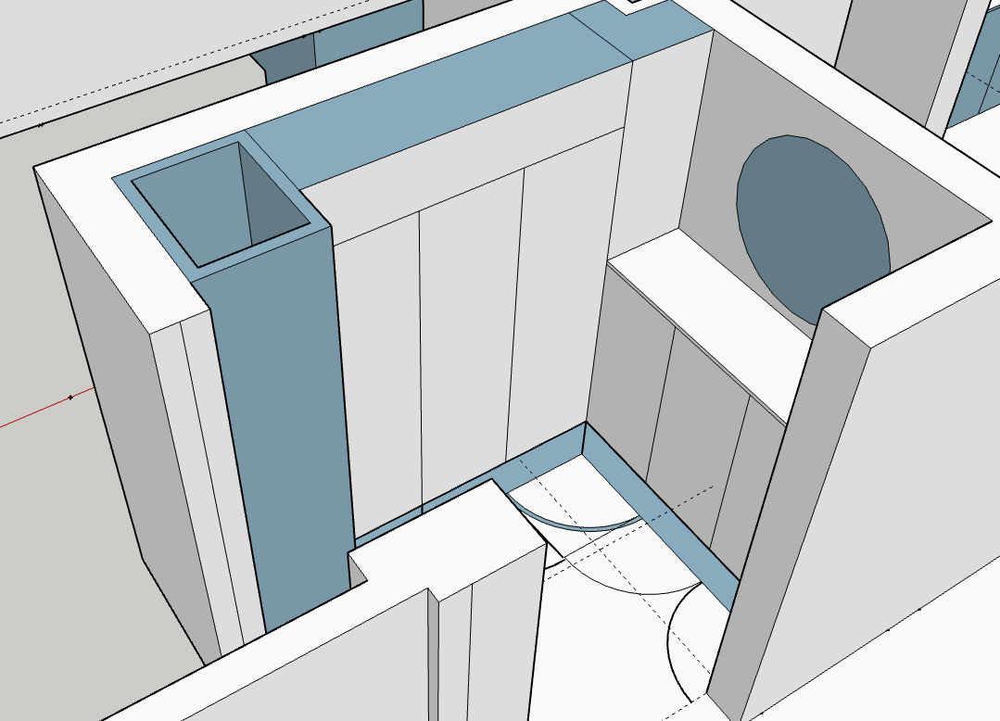
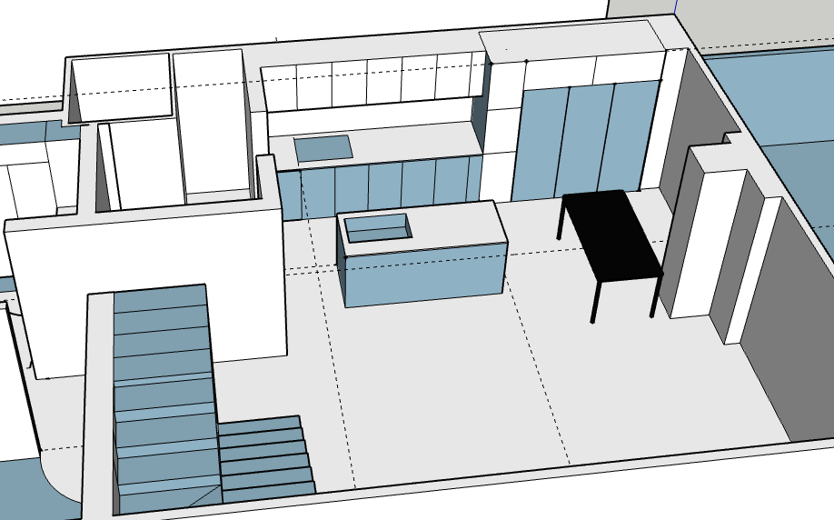
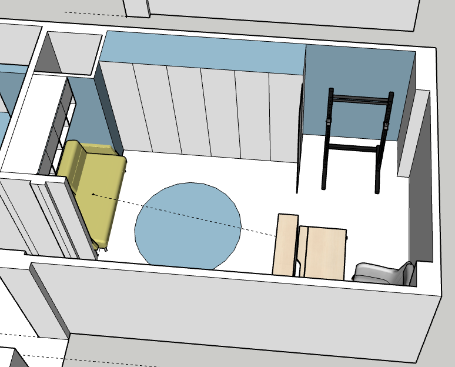
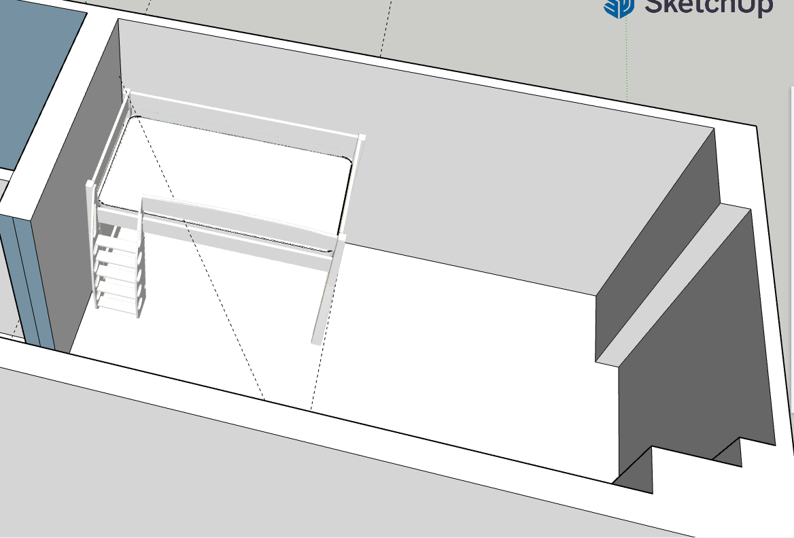

# SketchUp for Remodeling

I made 3D house for remodeling by using the SketchUp which is 3D modeling program.
And I used it just free version though their website.
It was very useful as simulation.
I could move and arrage some funitures in the simulation.
Also I could make the workers understand about my plan of remodeling.
To check about some detail, I just give him the capture image of the SketchUp.
---

#### My House (2 floors, 3 rooms and a Terrace)

#### Entrance

#### Kitchen

#### Room 1st

#### Room 2nd

